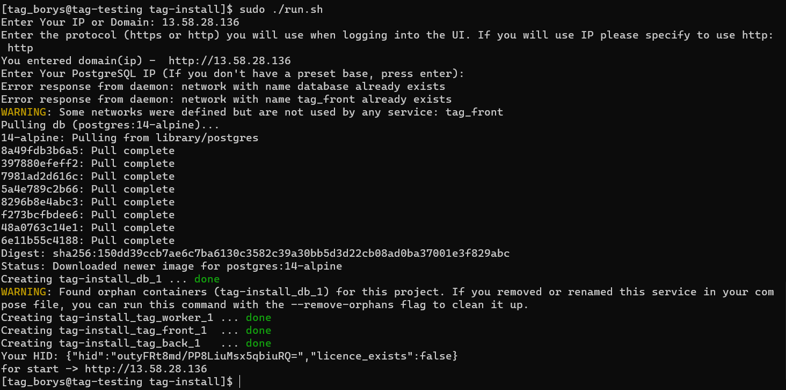

## Requirements:

-   Docker must be installed.
    
-   Docker Compose must be installed.
    
-   Application images should be available on the host where the installation will be performed.

## Installation Instructions for TAG Application:

1. Install docker and docker-compose to the server
    
2.  Download tag-back-1.tar.xz, tag-front-1.tar.xz, tag-worker-1.tar.xz to the server
    
3.  Load back image: `sudo docker load < /tmp/tag-back-1.tar.xz`

4. Load front image: `sudo docker load < /tmp/tag-front-1.tar.xz`

5. Load worker image: `sudo docker load < /tmp/tag-worker-1.tar.xz`

6. Download installation script:  
`git clone https://gitlab.com/tag-project/tag-install.git`

7. Prepare installation file: `cd tag-install/ && chmod +x run.sh`  

8. Run installation file: `sudo ./run.sh`

9. Enter Your IP or Domain:

10. Enter the protocol (https or http) you will use when logging into the UI. If you will use IP please specify to use http: 

11. Result

12. Enter Your PostgreSQL IP (If you don't have a preset base, press enter):

13. Installation done

14. Please copy the "**HID**" code and share it with the Trigger API Gateway team. This code is required by the team to generate a license file for you. Please provide the HID to your Trigger Software manager to proceed with obtaining the license.

15.   For installing license, please use the curl request with your license file and server:

> Command:
> `curl -F upload=@{path to the "license.key" file} http://{your IP or domain}/internal/license`
> Example:
> `curl -F upload=@license.key http://13.58.28.136/internal/license`
> Note: Please make sure to adjust the protocol type (HTTP or HTTPS)
> according to the one you have set up. This ensures that the command
> works correctly, especially when dealing with URLs starting with
> "https://" or "http://".
